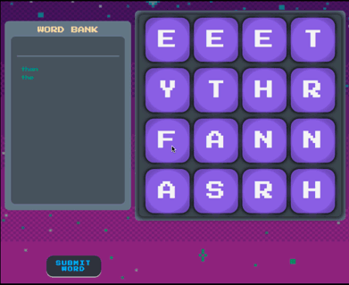

# Disarray
DisArray is a fast-paced, multi-player game inspired by Boggle! It is built with the MERN stack (MongoDB | Express | React | Node.js) and hosted on Heroku. Technologies include: Socket.IO, MongoDB, Mongoose, Express.js, React/ReactHooks, Redux, Node.js, HTML5, CSS3, Webpack, Heroku, Git, and Github.

## Game Play
Words are entered in one of two ways:

* Click on each tile individually, in order. When the word is fully spelled, click "Submit Word".

     

* Press the mouse button down over a word's first letter and drag the cursor over the subsequent letters. Release the mouse button to submit.

     

* To de-select the last letter selected, simply click it again (if clicking) / return to the previously selected letter (if dragging).

     

## Contributors
* Alejandro Weil
* Brad Trick
* Brekke Andrew Green
* Marco Torre

