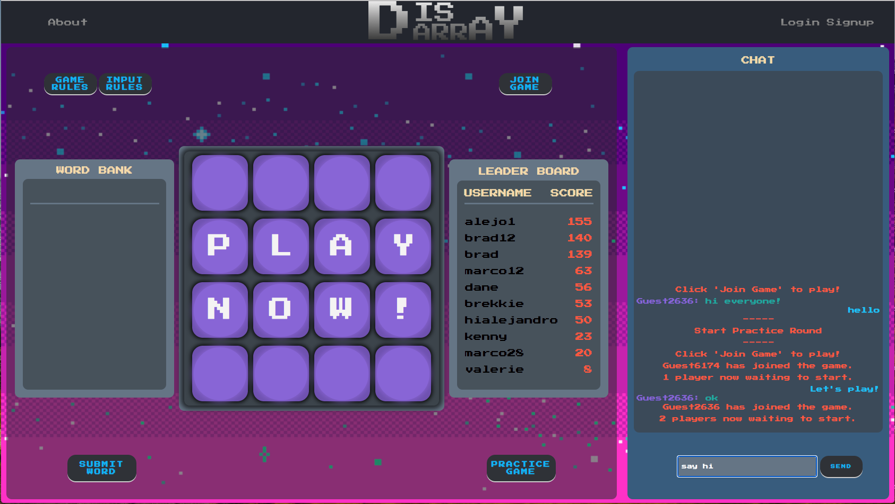
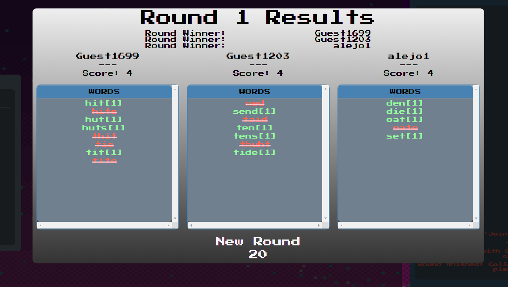
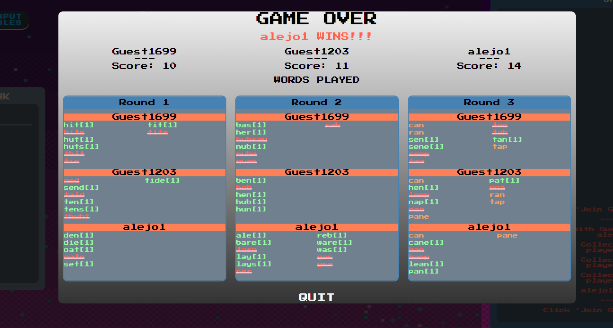
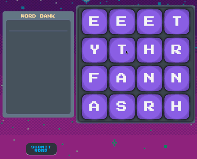
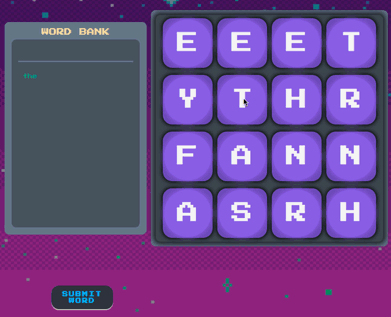

# Disarray



DisArray is a fast-paced, multi-player game inspired by Boggle! It is built with the MERN stack (MongoDB | Express | React | Node.js) and hosted on Heroku. Technologies include: Socket.IO, MongoDB, Mongoose, Express.js, React/ReactHooks, Redux, Node.js, HTML5, CSS3, Webpack, Heroku, Git, and Github.

## Game Play
Players have a minute and a half per round to find as many words as they can in the given letter tiles. At the end of each round, the words found are scored as follows: 
* non-words: 0 points
* words found by more than one player: 0 points
* 3-4 letters: 1 point
* 5 letters:   2 points
* 6 letters:   3 points
* 7 letters:   5 points
* 8 or more letters: 11 points



The player with the highest score after 3 rounds wins!


## Word Entry
Words are entered in one of two ways:

* Click on each tile individually, in order. When the word is fully spelled, click "Submit Word".

    
    <!--   -->

* Press the mouse button down over a word's first letter and drag the cursor over the subsequent letters. Release the mouse button to submit.

    
     <!--  -->

* To de-select the last letter selected, simply click it again (if clicking) / return to the previously selected letter (if dragging).

    
     <!--  -->

No letter tile can be used more than once in a single word. Consecutive letters must be adjacent in the grid.

## Contributors (and their primary areas of responsibility)  
### **Alejandro Weil** 
###  
### **Brad Trick**  
Brad implemented the game server and [socket.io](https://socket.io/) sockets that coordinate the flow of game elements across multiple clients on the web. The server and clients communicate through defined message types. For example, when the server receives a `chat` message from a client, it broadcasts the accompanying message to the appropriate `room`, either the other players in the game or, if the user is not currently in a game, the site more broadly: 
```js
//socket.js (Client)
this.socket.emit('chat', {
        gameId: this.currentGame, 
        username: this.props.username, 
        msg: this.state.chatMessage
});

//gameServer.js
socket.on("chat", ({gameId, username, msg}) => {
    if (gameId)
        socket.to(gameId).emit('chat', 
            {username, msg});
    else
        socket.to("site").emit('chat', 
            {username, msg});
});
```

Brad also implemented the inputting of words from the board. Event handlers monitor `mouseenter`, `mouseleave`, `mousedown`, and `mouseup` on the board tiles and store the results in the React state. For example, the handler for mouseleave submits the current word if the mouse leaves the board:
```js
handleMouseLeave(e) {
    const index = parseInt(e.currentTarget.dataset.index);
    if (!this.mouseDown) return;
    if (([0,   4,  8, 12].includes(index) && 
        (e.nativeEvent.offsetX < 0)) || //exit left
        ([0,   1,  2,  3].includes(index) && 
        (e.nativeEvent.offsetY < 0)) || //exit top
        ([3,   7, 11, 15].includes(index) && 
        (e.nativeEvent.offsetX > e.currentTarget.offsetWidth)) || //exit right
        ([12, 13, 14, 15].includes(index) && 
        (e.nativeEvent.offsetY > e.currentTarget.offsetHeight))) //exit bottom
    {
            this.submitAndReset();
    }
}
```
### **Brekke Andrew Green**  
### **Marco Torre**  

